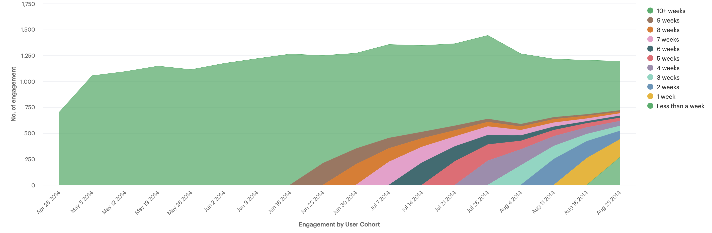

# SQL-projects
A repository is for my daily SQL practice.

## Practice 1: Investigating a Drop in User Engagement [Mode practice](https://mode.com/sql-tutorial/a-drop-in-user-engagement-answers/)
**Problem** [A chart](https://app.mode.com/modeanalytics/reports/cbb8c291ee96/runs/7925c979521e/embed) from Yammer shows the number of engaged users each week. Yammer defines engagement as having made some type of server call by interacting with the product (shown in the data as events of type "engagement"). Any point in this chart can be interpreted as "the number of users who logged at least one engagement event during the week starting on that date." 

**Task** You are responsible for determining what caused the dip at the end of the chart shown above and, if appropriate, recommending solutions for the problem.

#### Step 1: Investigating a new signup trend
```
SELECT
  DATE_TRUNC('day', created_at) as created_day,
  COUNT(user_id) as all_users,
  COUNT(CASE WHEN state = 'active' THEN user_id ELSE NULL END) as active_users
FROM tutorial.yammer_users
WHERE created_at >= '2014-06-01'
   AND created_at < '2014-09-01'
GROUP BY DATE_TRUNC('day', created_at)
ORDER BY DATE_TRUNC('day', created_at)
```
> Result: New signup did not decrease, the growth is still strong.

#### Step 2: Investigating if there is an engagement gap bettwen new users and old users.
```
WITH user_engagement_cte AS(
  SELECT
  u.user_id,
  u.activated_at,
  e.occurred_at,
  e.event_type,
  EXTRACT('day' FROM '2014-09-01'::timestamp - u.activated_at) AS user_age,
  EXTRACT('day' FROM '2014-09-01'::timestamp - e.occurred_at) AS user_event_age
  FROM tutorial.yammer_users u JOIN tutorial.yammer_events e
    ON u.user_id = e.user_id
  WHERE
    e.event_type = 'engagement'
    AND u.activated_at IS NOT NULL
)

SELECT
  DATE_TRUNC('week', occurred_at) as event_week,
  ROUND(AVG(user_event_age) / 7) AS "Average user age during week", --devided by 7 to calculate user age in weeks
  COUNT(DISTINCT CASE WHEN user_age >= 70 THEN user_id ELSE NULL END) AS "10+ weeks",
  COUNT(DISTINCT CASE WHEN user_age >= 63 AND user_age < 70 THEN user_id ELSE NULL END) AS "9 weeks",
  COUNT(DISTINCT CASE WHEN user_age >= 56 AND user_age < 63 THEN user_id ELSE NULL END) AS "8 weeks",
  COUNT(DISTINCT CASE WHEN user_age >= 49 AND user_age < 56 THEN user_id ELSE NULL END) AS "7 weeks",
  COUNT(DISTINCT CASE WHEN user_age >= 42 AND user_age < 49 THEN user_id ELSE NULL END) AS "6 weeks",
  COUNT(DISTINCT CASE WHEN user_age >= 35 AND user_age < 42 THEN user_id ELSE NULL END) AS "5 weeks",
  COUNT(DISTINCT CASE WHEN user_age >= 28 AND user_age < 35 THEN user_id ELSE NULL END) AS "4 weeks",
  COUNT(DISTINCT CASE WHEN user_age >= 21 AND user_age < 28 THEN user_id ELSE NULL END) AS "3 weeks",
  COUNT(DISTINCT CASE WHEN user_age >= 14 AND user_age < 21 THEN user_id ELSE NULL END) AS "2 weeks",
  COUNT(DISTINCT CASE WHEN user_age >= 7 AND user_age < 14 THEN user_id ELSE NULL END) AS "1 week",
  COUNT(DISTINCT CASE WHEN user_age >= 0 AND user_age < 7 THEN user_id ELSE NULL END) AS "Less than a week"
FROM user_engagement_cte
GROUP BY DATE_TRUNC('week', occurred_at)
ORDER BY DATE_TRUNC('week', occurred_at)
```

> Result: Old users are not engaging as much as new users. The engagement rate of old users need to be improved.


